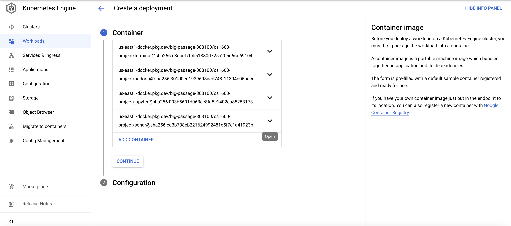
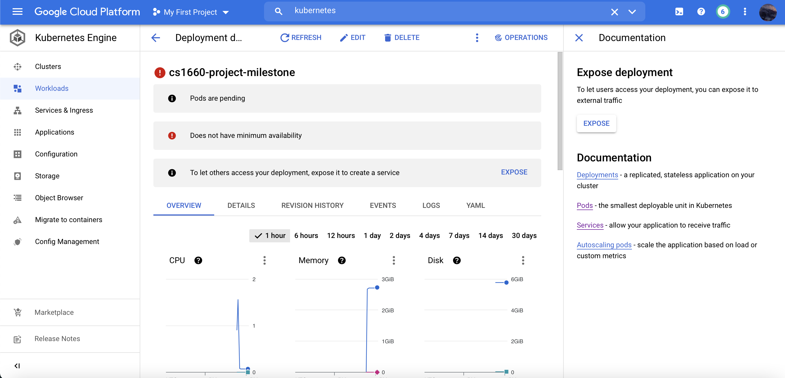

# cs1660-course-project

## Steps to running Docker images on Kubernetes:
First thing I did was get all the images I needed from Docker Hub. The following images were used:
- [cmarkulin/cs1660-project](https://hub.docker.com/r/cmarkulin/cs1660-project)
- [sonarsource/sonar-scanner-cli](https://hub.docker.com/r/sonarsource/sonar-scanner-cli)
- [bitnami/jupyter-base-notebook](https://hub.docker.com/r/bitnami/jupyter-base-notebook)
- [bitnami/spark](https://hub.docker.com/r/bitnami/spark)
- [harisekhon/hadoop](https://hub.docker.com/r/harisekhon/hadoop)

Next I performed the following steps:
- Created an artifact registry repository for housing the Docker images in GCP
- Then I tagged all of the docker images I pulled on my local machine so that I could push them to the GCP artifact registry.
- I then opened the Kubernetes Engine console in GCP and created a cluster from the containers for each application image I pushed to the artifact registry (image below for reference):

Below is the screenshot of the cluster running in GCP's offering of Kubernetes (running with errors):  

